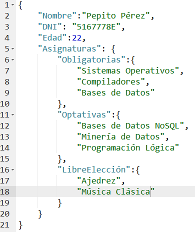

% Introducción JSON
% Adolfo Sanz De Diego
% Octubre 2017

# Acerca de

## Autor

- **Adolfo Sanz De Diego**
    - Blog: [asanzdiego.blogspot.com.es](http://asanzdiego.blogspot.com.es/)
    - Correo: [asanzdiego@gmail.com](mailto:asanzdiego@gmail.com)
    - GitHub: [github.com/asanzdiego](http://github.com/asanzdiego)
    - Twitter: [twitter.com/asanzdiego](http://twitter.com/asanzdiego)
    - LinkedIn: [in/asanzdiego](http://www.linkedin.com/in/asanzdiego)
    - SlideShare: [slideshare.net/asanzdiego](http://www.slideshare.net/asanzdiego/)

## Licencia

- **Copyright:**
    - Antonio Sarasa Cabezuelo <[antoniosarasa@campusciff.net](mailto:antoniosarasa@campusciff.net)>

## Fuente

- Las slides y sus fuentes las podéis encontrar en:
    - <https://github.com/asanzdiego/curso-intro-linux-web-sql-2016>

# Introducción a JSON

## ¿Qué es?

- JSON (**JavaScript Object Notation**) es un
formato de datos que se caracteriza:
    - Está basado en JavaScript.
    - Es utilizado para el intercambio de datos.
    - Es utilizado por muchas APIs de sitios web tales como
Facebook, Twitter,... para devolver su contenido.
    - Es independiente del lenguaje
    - Los archivos tienen extensión .json

## Parejas clave=valor

- JSON representa objetos de manera textual
mediante **parejas clave=valor**,

## Sintaxis JSON

- Un objeto se representa como una secuencia de
parejas clave=valor encerradas entre llaves { y }.

- Las claves son cadenas de texto entre comillas " y ".

## Valores JSON

- Tipos básicos: **cadena, número, booleano, null**
- **Arrays** de valores: entre corchetes [ y ]
- Otros **objetos** JSON: entre llaves { y }

## Ejemplo JSON (I)

- Considerar el siguiente ejemplo dónde se
quiere representar la ficha de un estudiante
con sus datos personales y asignaturas
matriculadas:
    - Nombre="Pepito Pérez"
    - DNI="517899R"
    - Edad="22"

## Ejemplo JSON (II)

- Asignaturas matriculadas:
    - Obligatorias: Sistemas Operativos, Compiladores,
y Bases de Datos.
    - Optativas: Bases de Datos NoSQL, Minería de
Datos, Programación Lógica.
    - Libre Elección: Ajedrez, Música Clásica

## Ejemplo JSON (III)

- La ficha de información se puede representar
en un documento JSON de la siguiente
manera:

## Ejemplo API

- <http://jsonplaceholder.typicode.com/posts>

- <http://jsonplaceholder.typicode.com/posts/1/comments>
